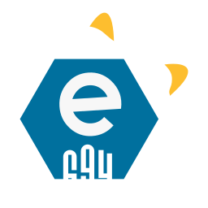

   
  <i>If you'd like to support what I do, please consider donating, it'd help a lot, and it'd help keep "e694.net" up!</i>
   
  
   
  
   
  <i>I also take <a href="https://cash.app/$kckarnige">CashApp</a> (Yes, I am that broke)</i>

 
 
 

>*(A-Z/1-9) FIX -> 694*

For anyone who wants to send someone else an eSix or eNine post. Embeds show post info like rating, score, date posted, and the presumed author based on tags. It also supports video for Discord embeds! All you need to do is switch "e621" with "e694" in the URL; this also works with "e926"!

----

### Why should I use this?

- No restrictions on who or what can fetch the content.
- Unlike eSix and eNine's embeds, e694 embeds support displaying video! If the video contains sound, the embed will let you know!
- Media URLs are shorter and straight-forwards.
- Works just about the same as official eSix.
- Author count also includes contributors.
- Media display size in embeds are consistent, meaning pixel art can be seen in embeds just as well as a video.

----

## Available Domains:

- e694.net
- e.e694.net
- e621.e694.net
- e621.kckarnige.online
- e621-media.vercel.app

### Filtered Domains:

- s.e694.net
- e694.kckarnige.online
- e694.vercel.app
- e926.kckarnige.online
- e926-media.vercel.app

<h3>What's the difference?</h3>

"e621" is known as "the furry porn website", however they do have a alternative domain which displays EXCLUSIVELY safe-rated content called "e926".

"Filtered" domains will link to eNine, and if the post is meant to link to anything above a "safe" rating, it will not be displayed.

## Examples:

### File Example:

`https://s.e694.net/5302549.gif`  
or  
`https://s.e694.net/posts/5302549/file`  
or  
`https://s.e694.net/posts/5302549/file.gif`

### Embed Example:

`https://s.e694.net/5302549.gif?embed=true`  
or  
`https://s.e694.net/posts/5302549`

Works with videos too!

