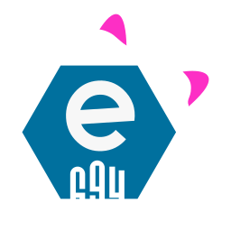

# e694 — Cloudflare Workers port



This repository is the complete Cloudflare Workers conversion of e694 1.8.1. It serves the existing static files through Workers Static Assets and implements the former Vercel serverless handler as a native Fetch API Worker.

<br clear="left">

## Compatibility

The following public URLs are preserved:

- `/posts/:postId` — embed page
- `/posts/:postId/file` — raw media
- `/posts/:postId/file.ext` — raw media with an explicit extension
- `/posts/:postId/file.json` — e621-style post JSON
- `/posts/:postId/file.json+oembed` — oEmbed JSON
- `/api/yiff.js?slug=...` — legacy direct API URL
- `/api/yiff.min.js?slug=...` — legacy minified API URL
- `/api.min.js?slug=...` — legacy root API URL
- Numeric post IDs and 32-character MD5 hashes
- Safe/filtered and unfiltered host behavior from `public/unfiltered.json`

The Worker also streams media instead of buffering the entire file and forwards byte-range requests, which improves video playback and avoids the Node `Buffer` dependency used by the Vercel version.

## Local development

Requirements: Node.js 20 or newer.

```bash
npm install
npm test
npm run dev
```

Wrangler prints a local URL. Test routes such as:

```text
http://localhost:8787/posts/5302549
http://localhost:8787/posts/5302549/file
```

Localhost is treated as filtered unless you add `localhost` to `public/unfiltered.json` while testing.

## Deploy from the command line

```bash
npm install
npx wrangler login
npm run deploy
```

No build step, database, KV namespace, R2 bucket, or secrets are required.

## Deploy from GitHub through Cloudflare

1. Create a new GitHub repository and upload the contents of this folder to the repository root.
2. In Cloudflare, open **Workers & Pages** and import the Git repository as a Worker.
3. Leave the build command empty.
4. Use `npx wrangler deploy` as the deploy command.
5. Deploy the project.

Cloudflare uses the Wrangler version pinned in `package.json`.

## Attach the domains

For each hostname, open the Worker in Cloudflare and go to **Settings → Domains & Routes → Add → Custom Domain**. Add every hostname individually; Worker Custom Domains require an exact hostname and do not use wildcard matching.

Suggested unfiltered domains, matching `public/unfiltered.json`:

```text
e694.net
e.e994.net
e621.e694.net
e621.e994.net
e621.kckarnige.online
```

Suggested filtered domains from the original project:

```text
e994.net
s.e694.net
e926.e694.net
e926.e994.net
e694.kckarnige.online
e926.kckarnige.online
```

If a hostname already has a CNAME or another conflicting DNS record, remove that record before adding it as a Worker Custom Domain. Cloudflare creates the replacement DNS record and certificate.

## Filter configuration

`public/unfiltered.json` is the source of truth. A request hostname included in that array uses e621 and permits all ratings. Any hostname absent from that array uses e926 safe mode and returns `public/unsafe.png` for non-safe media.

After changing the file, commit and redeploy.

## Project structure

```text
.
├── src/index.js          Cloudflare Worker and routing logic
├── public/               Static assets bundled with the Worker
├── test/worker.test.js   Route and response tests
├── wrangler.jsonc        Worker/static-assets configuration
├── package.json          Development and deployment commands
└── source-assets/        Non-deployed editable source artwork
```

## Validation

```bash
npm test
npm run check
```

`npm run check` performs a Wrangler dry-run bundle, including the static asset manifest, without deploying.

## Fixing an upstream HTTP 403

The Worker uses a contact-identifying `E621_USER_AGENT` by default. You can override it under `vars` in `wrangler.jsonc`. Keep the value descriptive and include a project/contact URL.

If e621 still returns HTTP 403 to Cloudflare egress, add an e621 username and API key as encrypted Worker secrets:

```bash
npx wrangler secret put E621_LOGIN
npx wrangler secret put E621_API_KEY
npm run deploy
```

Do not place the API key in `wrangler.jsonc` or commit it to Git. Authentication is sent only to the e621 JSON API, never to media CDN hosts.

To distinguish an upstream 403 from a Cloudflare security block, request a JSON route directly:

```bash
curl -i "https://YOUR-DOMAIN/api/yiff.js?slug=5302549.json"
```

- An e694 JSON response containing `upstream_service` means the Worker ran and the named upstream returned the status.
- A Cloudflare-branded HTML error page means Cloudflare Access, WAF, or another zone security feature blocked the visitor before the Worker response.

View live Worker diagnostics with `npx wrangler tail` or from **Workers & Pages → your Worker → Logs → Live**.

## License

The original project license is retained in `LICENSE`.
