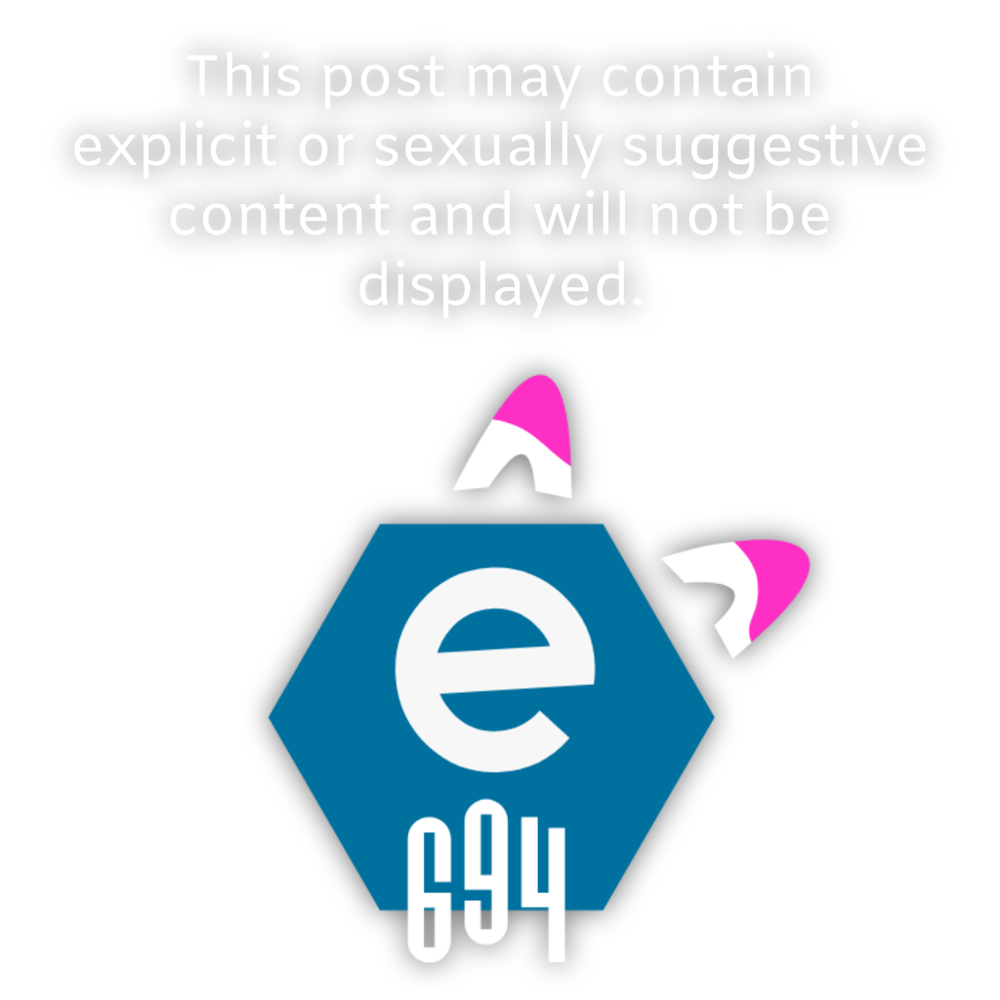

   
   
  <i>If you'd like to support what I do, please consider donating, it'd help a lot, and it'd help keep "e694.net" up!</i>
   
   
  
   
  
   
  
   
  <i>I also take <a href="https://cash.app/$kckarnige">CashApp</a> (Yes, I am that broke)</i>

 
 
 

>*(A-Z/1-9) FIX -> 694*

For anyone who wants to send someone else an eSix or eNine post. Embeds show post info like rating, score, date posted, and the presumed author based on tags. It also supports video for Discord embeds! All you need to do is switch "e621" with "e694" in the URL; this also works with "e926"!

----

### Why should I use this?

- No restrictions on who or what can fetch content.
- Adding '/file' at the end gives you the raw media file.
- If the post is a video containing sound, the embed will let you know!
- The author count in embeds also includes contributors.
- Media display size in embeds are consistent, meaning pixel art can be seen in embeds just as well as a 4K image!
- Just change your link's domain from 'e621.net' to 'e694.net', and you're good to go!

----

## Official Domains:

- e694.net
- e.e694.net
- e621.e694.net
- e621.kckarnige.online
- e621-media.vercel.app

**"Safe" Filtered Domains:**

- s.e694.net
- e926.e694.net
- e694.kckarnige.online
- e694.vercel.app
- e926.kckarnige.online
- e926-media.vercel.app
---
<h3>What's the difference?</h3>
eSix is known for it's explicit content, however they do have a alternative domain which displays EXCLUSIVELY posts rated as "safe" called "eNine" (e926.net).
  
When using a "filtered" domain, if the post is meant to link to anything above a "safe" rating, it will not be displayed, even if the media file for the post itself is trying to be fetched.
  
Attempting to do so will serve this image:
  

## Link Examples:

### File Example:

`https://s.e694.net/posts/5302549/file`  
or  
`https://s.e694.net/posts/5302549/file.gif`

### Embed Example:

`https://s.e694.net/posts/5302549`

Works with videos too!

## Self Hosting

This was made with Vercel, and as such it's pretty simple to make your own deployment!
Here's the *magic 'deploy' button.*

I will not be providing *any* assistance with deploying, you're on your own. If self deploying is even a thing on your mind, you definitely have the brain-power do it on your own, I believe in you. :3 